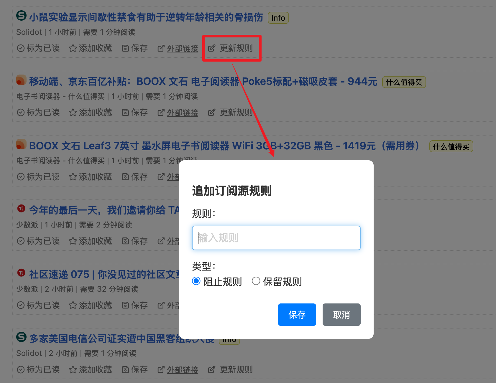

# Miniflux Enhancer

[简体中文](README.zh-CN.md)

A Chrome extension to enhance Miniflux Web UI functionality.

## Features

- **Update Rules**: Adds an "Update Rule" button to each entry, allowing you to add block or keep rules for a feed and automatically process matching unread entries.
- **Thumbnails**: Displays a thumbnail for each entry in the article list. Hover over the thumbnail to see a larger preview.
- **Custom Styling**: Adds unique CSS classes for feed and category pages (e.g., `feed-ID`, `category-ID`), making it easy to apply custom styles to specific sources.

## Installation

1. Download the source code of this extension
2. Open Chrome browser and navigate to the extensions management page (chrome://extensions/)
3. Enable "Developer mode"
4. Click "Load unpacked"
5. Select the directory of this extension

## Usage

1. In Miniflux's article list page, an "Update Rule" button will appear in the action button area of each entry
2. Click the button to open a dialog
3. Enter a rule in the dialog and select the rule type (Block Rule or Keep Rule)
4. After clicking save, the rule will be added to the feed and related unread entries will be processed automatically

## Notes

- This extension only works with the official Miniflux Web UI
- Make sure you have management permissions for the corresponding feed

## Acknowledgements

- The thumbnail feature is inspired by the [Miniflux thumbnails](https://greasyfork.org/en/scripts/496408-miniflux-thumbnails) script.
