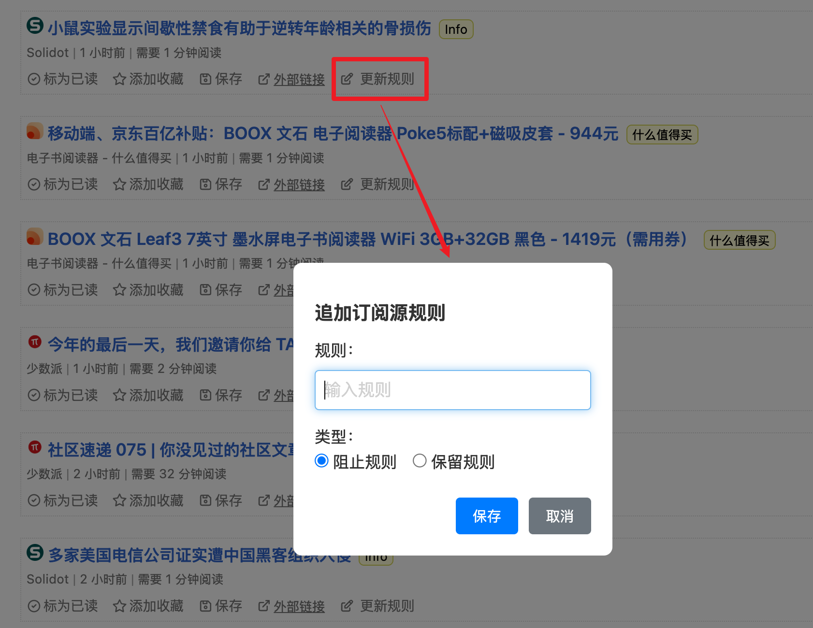

# Miniflux Enhancer

[English](README.md)

这是一个用于增强 Miniflux Web UI 功能的 Chrome 扩展。

## 功能

- **更新规则**：在每个条目上添加“更新规则”按钮，允许您为订阅源添加阻止或保留规则，并自动处理匹配的未读条目。
- **文章缩略图**：在文章列表中为每个条目显示缩略图，并将鼠标悬停在缩略图上时显示更大的预览图。
- **自定义样式**：为订阅源和分类页面添加了唯一的 CSS class（如 `feed-ID` 和 `category-ID`），方便您通过自定义 CSS 为特定来源添加样式。

## 安装方法

1. 下载本扩展的源代码
2. 打开 Chrome 浏览器，进入扩展管理页面（chrome://extensions/）
3. 开启"开发者模式"
4. 点击"加载已解压的扩展程序"
5. 选择本扩展的目录

## 使用方法

1. 在 Miniflux 的文章列表页面中，每个条目的操作按钮区域会出现一个"更新规则"按钮
2. 点击按钮后会弹出对话框
3. 在对话框中输入规则，选择规则类型（阻止规则或保留规则）
4. 点击保存后，规则将被添加到该订阅源，并自动处理相关的未读条目

## 注意事项

- 本扩展仅在 Miniflux 的官方 Web UI 中生效
- 需要确保您有相应订阅源的管理权限

## 致谢

- 文章缩略图功能的实现参考了 [Miniflux thumbnails](https://greasyfork.org/zh-CN/scripts/496408-miniflux-thumbnails) 脚本。
